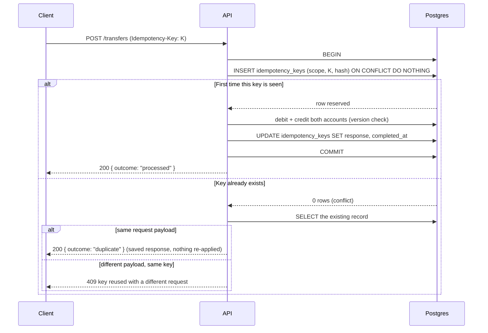
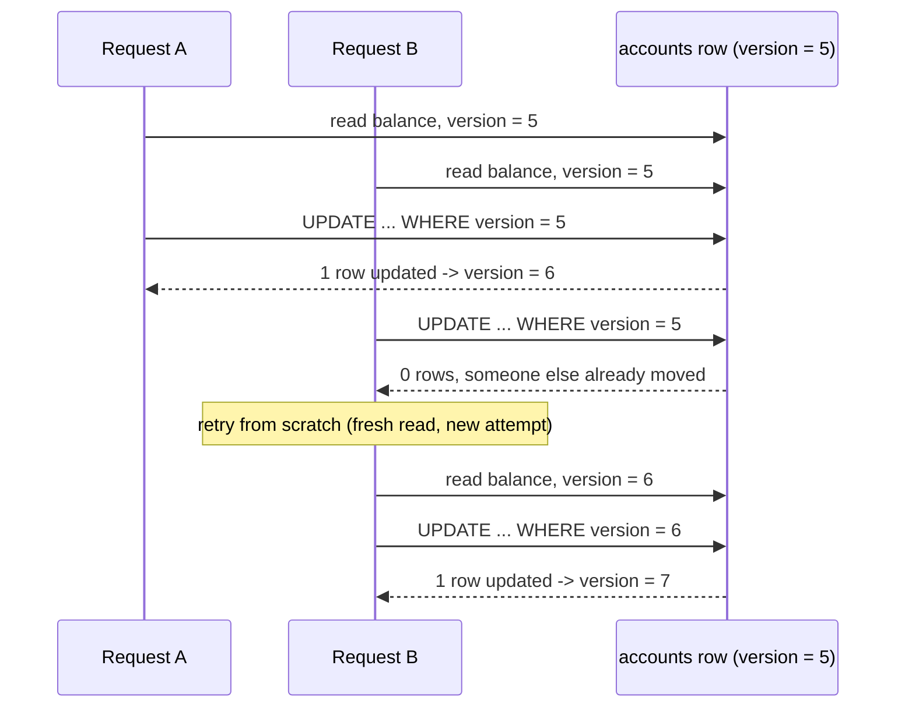

# Banking Ledger

A double-entry ledger `API` built with `Bun`, `Elysia`, and `Postgres` — every deposit, withdrawal, and transfer is idempotent and safe under concurrency, without weakening either guarantee to make the other easier.

## Flow

**1. Idempotent write**



**2. Concurrent write to the same account**



## Why this design

An `INSERT ... ON CONFLICT DO NOTHING` on a unique `(scope, key)` index is the only thing deciding who "wins" a race between duplicate requests — not application code. Reservation, business logic, and marking the key complete all happen inside one `db.transaction`, so a crash or a lock conflict midway rolls back the reservation too. A retried request never finds a half-finished key: either it doesn't exist yet, or it's fully committed with a saved response ready to replay.

Balances use optimistic locking instead of `SELECT ... FOR UPDATE`: a `version` column and a compare-and-swap `UPDATE ... WHERE id = ? AND version = ?`. Zero rows updated means someone else moved first, and the whole operation — idempotency check included — retries from a fresh read. This holds under plain `READ COMMITTED`, needs no row locks held across round trips, and is exactly what the web app's "Concurrency lab" demonstrates live: fire four requests at once, watch one win and three retry cleanly.

A transfer is the one operation touching two account rows at once, so it always updates them in the same fixed order (lower `id` first) no matter which account is sending and which is receiving. Two transfers moving money in opposite directions between the same two accounts would otherwise lock each other out — the same problem as two threads acquiring two mutexes in reverse order. Fixed ordering makes that deadlock structurally impossible instead of something to catch and retry.

Deposits and withdrawals only touch one account and write one ledger entry — the other side of that movement is money entering or leaving the system from outside it, and there's no vault account here to hold that leg. A transfer moves money between two accounts that both exist in the ledger, so it always writes a matching debit and credit in the same transaction — inserted together, or not at all.

## Getting started

`Docker` and `Bun` 1.4+ are the only requirements.

**1. Configure**

```bash
cp .env.example .env
```

Set `POSTGRES_PASSWORD` — the `Postgres` container refuses to initialize without it.

**2. Install dependencies**

```bash
bun install
```

Needed even though the app itself runs in `Docker`: `make migrate` and `make studio` shell out to `drizzle-kit` locally.

**3. Start Postgres and create the schema**

```bash
make migrate
```

Starts the `Postgres` container and applies every migration, seeding `User A`–`User D`, each with a $0 balance. This comes before anything else — on an empty database every route fails with `relation "users" does not exist`.

**4. Start the stack**

```bash
make up
```

Web on `localhost:3000`, API on `localhost:3001`. Open the web app, pick a user, and run the "Concurrency lab": fire deposits with the same idempotency key and watch three of four collapse into `duplicate`; drop the key and watch all four apply for real.

## Commands

```bash
make up                # start Postgres, API, and web via Docker
make down               # stop everything started with `make up`
make migrate            # start Postgres (if needed) and apply pending migrations
make studio             # browse the database

bun run dev             # API + web locally, both with hot reload (alternative to `make up`)
bun test                # full suite, including integration tests against the Postgres above
bun run db:generate     # scaffold a new migration from schema.ts changes
```

## After changing dependencies

```bash
docker compose build api web
make up
```

The API and web Docker images copy each `packages/*` folder by name into their final build stage. A new workspace dependency needs a rebuild either way — hot reload inside a running container never reaches a stale image.

## Starting over

```bash
docker compose down -v
make migrate
```

`down -v` drops the Postgres volume along with every balance and transaction created while testing; `make migrate` brings back the schema and the four zero-balance users.
