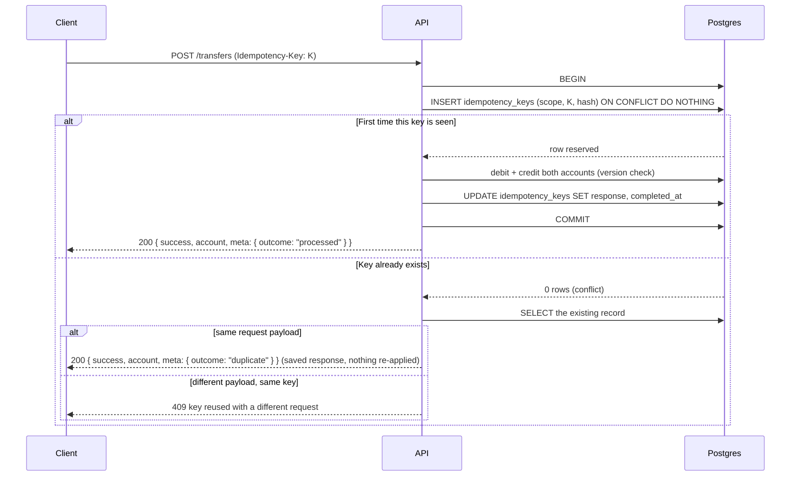
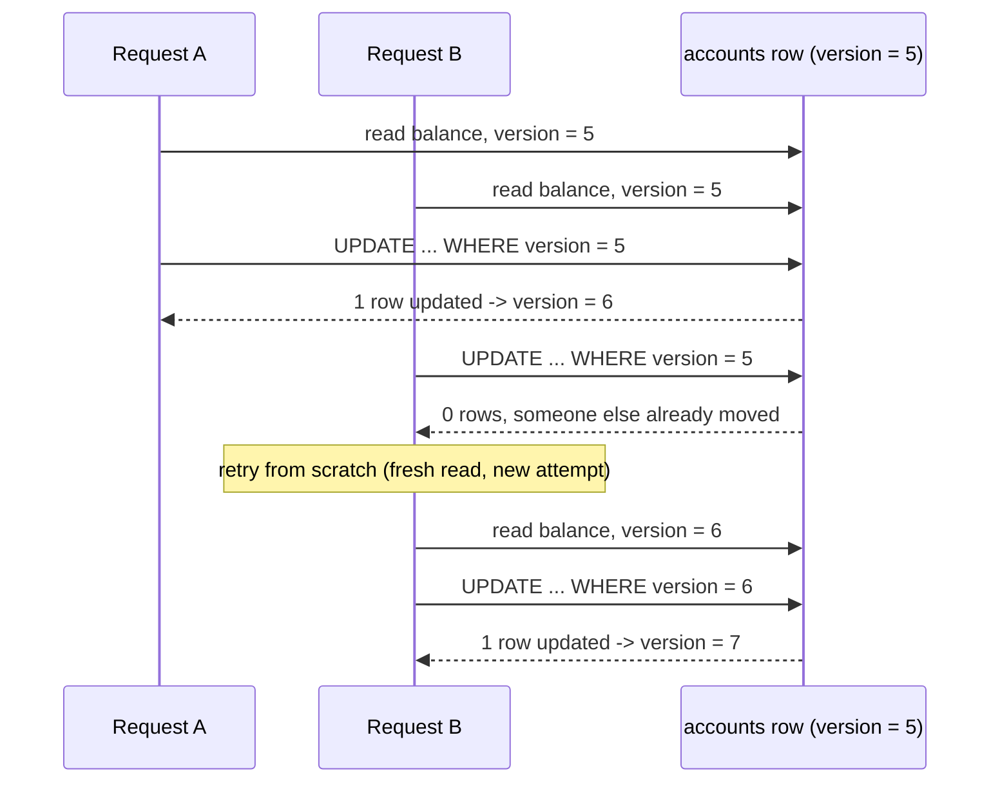
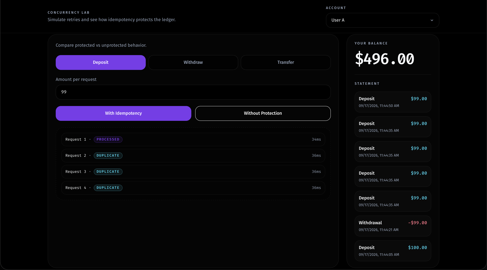

## Flow

**1. Idempotent write**



**2. Concurrent write to the same account**



## Why this design

An `INSERT ... ON CONFLICT DO NOTHING` on a unique `(scope, key)` index is the only thing deciding who "wins" a race between duplicate requests — not application code. Reservation, business logic, and marking the key complete all happen inside one `db.transaction`, so a crash or a lock conflict midway rolls back the reservation too. A retried request never finds a half-finished key: either it doesn't exist yet, or it's fully committed with a saved response ready to replay.

Balances use optimistic locking instead of `SELECT ... FOR UPDATE`: a `version` column and a compare-and-swap `UPDATE ... WHERE id = ? AND version = ?`. Zero rows updated means someone else moved first, and the whole operation — idempotency check included — retries from a fresh read. This holds under plain `READ COMMITTED` and needs no row locks held across round trips. The lab runs both cases. Four deposits with the same idempotency key collapse into one `processed` and three `duplicate`. Four deposits without a key all apply, and a request that loses the version check retries from a fresh read.

A transfer is the one operation touching two account rows at once, so it always updates them in the same fixed order (lower `id` first) no matter which account is sending and which is receiving. Two transfers moving money in opposite directions between the same two accounts would otherwise lock each other out — the same problem as two threads acquiring two mutexes in reverse order. Fixed ordering makes that deadlock structurally impossible instead of something to catch and retry.

Deposits and withdrawals only touch one account and write one ledger entry — the other side of that movement is money entering or leaving the system from outside it, and there's no vault account here to hold that leg. A transfer moves money between two accounts that both exist in the ledger, so it always writes a matching debit and credit in the same transaction — inserted together, or not at all.

## Getting started

`Docker` is the only requirement.

Create `.env` in the repo root. Postgres refuses to start without `POSTGRES_PASSWORD`.

```
POSTGRES_USER=postgres
POSTGRES_PASSWORD=
POSTGRES_DB=banking-ledger
POSTGRES_PORT=5432

PORT=3000
API_PORT=3001
```

```bash
make migrate            # start Postgres and apply every migration
make up                 # start Postgres, API, and web via Docker
make down               # stop all services
make studio             # opens database browser
```

Web on `localhost:3000`, API on `localhost:3001`. Open the web app, pick a user, and run the "Concurrency lab": fire deposits with the same idempotency key and watch three of four collapse into `duplicate`; drop the key and watch all four apply for real.

## Preview


